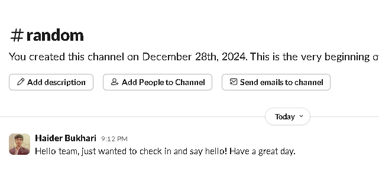

# AutoGen

## 1. Install Required Libraries

First, you need to install the necessary packages:


Integry requires Python version 3.12 or higher


* **Integry** is used to integrate structured tools and functions.
* **AutoGen** integrate tools and automate workflows using large language models.

```python
pip install integry autogen
```

## 2. Initialize Integry & Agent

Import the necessary Libraries

```python
import os
from integry import Integry
from autogen import ConversableAgent, register_function
```

`User-ID` is a unique string identifier for a user in your app or agent. Function Calls and Integrations are associated to a user ID. It will be the email address you used during the signup process on Integry.

For example:

```python
user_id = "joe@example.com"
```

Below code snippet initializes the **Integry** class to interact with the Integry API using the **App-Key** and **App-Secret**.&#x20;

You can view and copy your `App-Key` and `App-Secret` from the [Workspace Settings](https://app.integry.io/wapp/settings/embed/).

<figure><figcaption><p>Workspace Settings</p></figcaption></figure>

```python
integry = Integry(
    app_key=os.environ.get("INTEGRY_APP_KEY"),
    app_secret=os.environ.get("INTEGRY_APP_SECRET"),
)
```

The code creates two AI agents: one is "Assistant" that helps perform tasks, and another is "User" that listens for a **`TERMINATE`** message to stop.&#x20;

The assistant uses an API key for GPT-4 You can get the API Key from the [OpenAI Platform](https://platform.openai.com/api-keys), while the user agent has a rule to stop when it receives the **`TERMINATE`** message.

<pre class="language-python" data-overflow="wrap"><code class="lang-python"><strong>llm_config = {"config_list": [{"model": "gpt-4o", "api_key": os.environ.get("OPENAI_API_KEY")}]}
</strong>
assistant = ConversableAgent(
    name="Assistant",
    system_message="You are a helpful integrations assistant. "
    "You can help users perform tasks in various apps. "
    "Return 'TERMINATE' when the task is done.",
    llm_config=llm_config,
)

user_proxy = ConversableAgent(
    name="User",
    llm_config=False,
    is_termination_msg=lambda msg: msg.get("content") is not None
    and "TERMINATE" in msg["content"],
    human_input_mode="NEVER",
)
</code></pre>

## 3. Register an Integry Function as a Tool

Before you can use the functions available in Integry, you need to add the app to Integry. Slack, however, is pre-added to Integry by default, so there’s no need to add it manually.&#x20;

The code retrieves a Slack post-message function from [Integry](https://app.integry.io/platform/functions). You can copy the function ID from the dropdown.&#x20;

For example

In this case the function ID is <mark style="color:blue;">slack-post-message</mark>

<figure><figcaption></figcaption></figure>

After getting the function ID,  we then registers it with the Autogen AI agents to enable the assistant to call the function.

<pre class="language-python"><code class="lang-python">function = await integry.functions.get("slack-post-message", user_id)
<strong>
</strong>function.register_with_autogen_agents(
    register_function,
    caller=assistant,
    executor=user_proxy,
    user_id=user_id,
)
</code></pre>

## 4. **Connect Your Slack Account**

To allow the agent to send a message on Slack on your user's behalf, the user must connect their Slack account. To connect a Slack account against the provided user ID, execute the following snippet.

```python
slack = await integry.apps.get("slack", user_id)
print(slack.login_url)
```

This will print a URL which can be opened in a web browser to connect Slack.

## 5. Execute Agent

This will execute the agent and send a **Hello from autogen to the team** message in the Slack random channel<mark style="color:blue;">.</mark>

```python
chat_result = await user_proxy.a_initiate_chat(
    assistant,
    message="Say hello from autogen to my team on slack in #random channel",
)
```

This will send the message to the slack channel. Here is reference image&#x20;

<figure><figcaption></figcaption></figure>

The message has been sent successfully in slack #random channel. You can verify the successful message delivery by checking the highlighted content in the response below.

<pre class="language-json"><code class="lang-json">User (to Assistant):

Say hello from autogen to my team on slack in #random channel

--------------------------------------------------------------------------------

>>>>>>>> USING AUTO REPLY...

>>>>>>>> USING AUTO REPLY...
Assistant (to User):

***** Suggested tool call (call_ClWxh8HVMTaR74K91HI3ixEa): slack-post-message *****
Arguments: 
{"input":{"channel":"#random","text":"Hello from autogen to the team!"}}
***********************************************************************************

--------------------------------------------------------------------------------

>>>>>>>> EXECUTING ASYNC FUNCTION slack-post-message...
User (to Assistant):

***** Response from calling tool (call_ClWxh8HVMTaR74K91HI3ixEa) *****
<strong><a data-footnote-ref href="#user-content-fn-1">{</a>"<a data-footnote-ref href="#user-content-fn-2">network_code":200,"output":{"</a>ok":true,"channel":"C086HKZMTSS","ts":"1735395154.257879","message":{"user":"U086GBQHLG0","type":"message","ts":"1735395154.257879","bot_id":"B086E311JTB","app_id":"A6FQL4KQC","text":"Hello from autogen to the team!","team":"T086682UW57","bot_profile":{"id":"B086E311JTB","app_id":"A6FQL4KQC","name":"Integry","icons":{"image_36":"https://slack-files2.s3-us-west-2.amazonaws.com/avatars/2017-08-09/225182834294_8020ddc74d7822b48ea1_36.png","image_48":"https://slack-files2.s3-us-west-2.amazonaws.com/avatars/2017-08-09/225182834294_8020ddc74d7822b48ea1_48.png","image_72":"https://slack-files2.s3-us-west-2.amazonaws.com/avatars/2017-08-09/225182834294_8020ddc74d7822b48ea1_72.png"},"deleted":false,"updated":1734709233,"team_id":"T086682UW57"},"blocks":[{"type":"rich_text","block_id":"BjV","elements":[{"type":"rich_text_section","elements":[{"type":"text","text":"Hello from autogen to the team!"}]}]}]}}}
</strong>**********************************************************************

--------------------------------------------------------------------------------

>>>>>>>> USING AUTO REPLY...

>>>>>>>> USING AUTO REPLY...
Assistant (to User):

<strong>I've posted the message "Hello from autogen to the team!" to the #random channel on Slack. TERMINATE
</strong>
--------------------------------------------------------------------------------

</code></pre>

[^1]: This success response show's that message has been sent successfully in slack channel.&#x20;

[^2]: This success response show's that message has been sent successfully in slack channel.&#x20;
