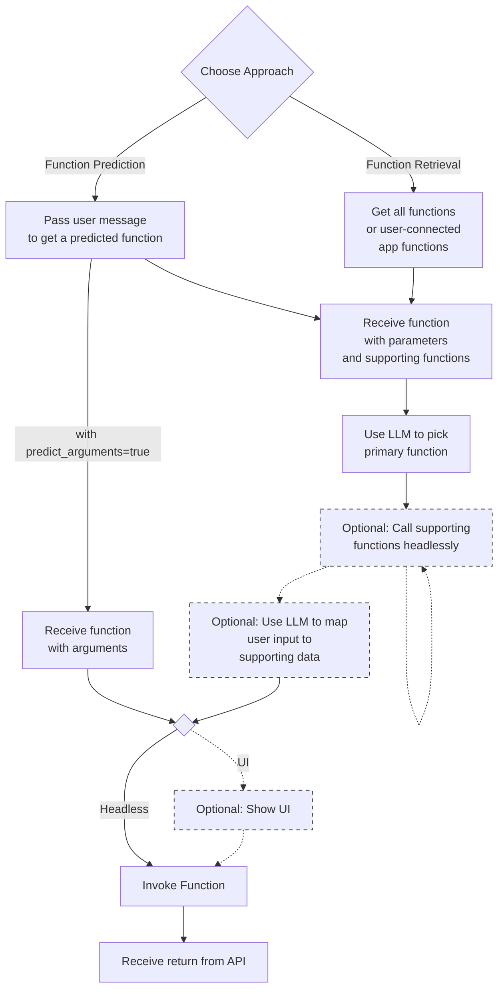

# Overview



## What are Integry Functions?

Integry Functions lets you use Integry's extensive library of app functions as tools within your AI applications. By leveraging Integry's [function-calling](https://platform.openai.com/docs/guides/function-calling) compatible JSON structures, you can invoke third-party app functions directly from your AI calls. You can:

* Access hundreds of third-party app functions.
* Use function-calling compatible JSON structures in your AI calls.
* Show a populated form of the action for user editing and confirmation
* Invoke functions directly (headlessly i.e. without a UI)&#x20;
* Predict and populate functions based on user input.

[Sign up now](https://app.integry.io/accounts/register/v3/signup/?product=functions) for a free trial and follow [Quickstart for AI](../getting-started/quickstart-for-ai.md) to get started.


Integry supports many functions for [200+ apps](https://www.integry.ai/apps). Click the **Marketplace** button in the app to browse the full list of Functions or [use the API](https://integry.gitbook.io/integry-docs/apis-and-sdks/api-reference#list-all-functions).


## Using Functions with Your AI

Generally, when using AI with function calling, you take the following steps:

1. **Collect User Input:** You collect a user message, which requires talking to an external API. For example: "<mark style="background-color:yellow;">send hello to my team on slack on #general</mark>"&#x20;
2. **Call AI Model:** You take the user message, their data context, and a prompt and pass a list of function specs with to the AI's API call
3. **AI Populates Function:** The AI selects the function, fills in its parameters, and returns the result
4. **Call Function:** You then call the function with the arguments and take next steps based on the response
5. **Validate Arguments (optional):** before calling the function in step 3, you might need to validate the user input. In our example, the user wrote #general whereas the actual channel was #general. To resolve this, you may need to first fetch all channels and find the closest match
6. **Show UI (optional):** you could also show the user the final function call in a UI before executing it.&#x20;

To achieve this, we have two methods. The first method is faster and easier to start with. The second method requires more effort but provides greater control. Here they are:

1. **Function Prediction**: Pass the user message to`/functions/?predict_function=true&prompt=<user_message>` to get the most relevant function. You can also get populated arguments.
2. **Function List Retrieval**: Retrieve a list of available functions using the `/functions` endpoint and pass them to your AI model. Your model will predict the function to use and will populate the arguments. You may need to validate your inputs with additional supporting function calls.

Both approaches converge after obtaining the function parameters, where you can choose to call the function directly or show  the UI.

## Additional Resources

* [OpenAI Function Calling Documentation](https://platform.openai.com/docs/guides/function-calling)
* [Integry API Reference](../apis-and-sdks/api-reference.md)
* [Integry.JS SDK Reference](../apis-and-sdks/js-sdk-reference/)

